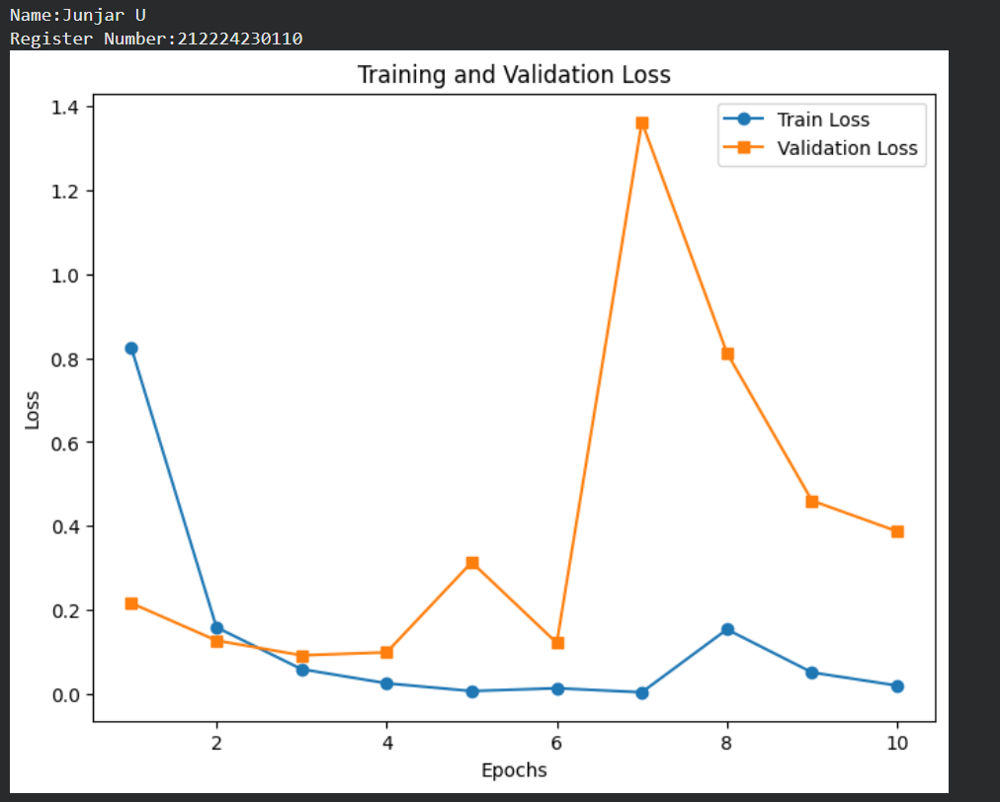
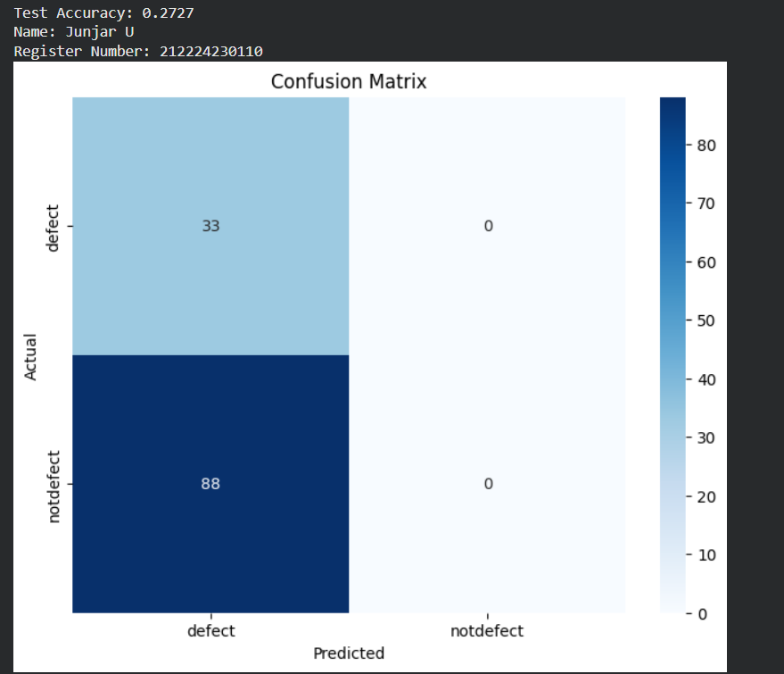
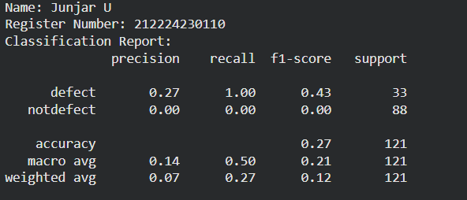
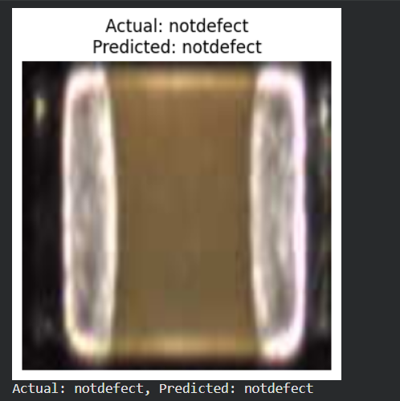
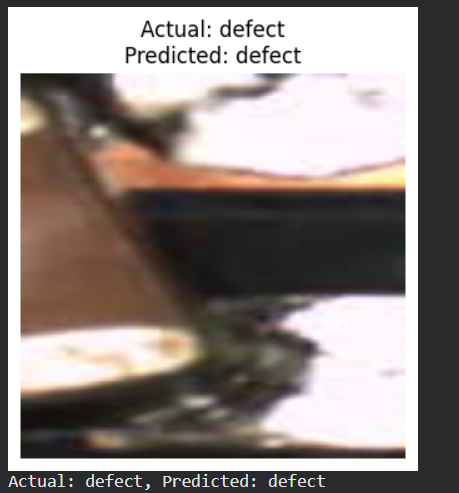

# DL- Developing a Neural Network Classification Model using Transfer Learning

## AIM
To develop an image classification model using transfer learning with VGG19 architecture for the given dataset.

## Problem Statement and Dataset
Include the problem statement and Dataset


## Neural Network Model
Include the neural network model diagram.

## DESIGN STEPS
### STEP 1: 

Import required libraries and preprocess the dataset (resize, normalize, convert to tensor). Load data using DataLoader.

### STEP 2: 

Load the pretrained VGG19 model, freeze feature layers, and modify the final layer for binary output.


### STEP 3: 

Define the loss function (BCEWithLogitsLoss) and choose Adam optimizer with a suitable learning rate.


### STEP 4: 

Train the model by performing forward pass, computing loss, backpropagation, and updating weights for multiple epochs.

### STEP 5: 

Evaluate the trained model on test data and calculate accuracy and other metrics.

### STEP 6: 

Predict the class of a new image using sigmoid activation and a threshold value of 0.5.


## PROGRAM

### Name: Junjar U

### Register Number: 212224230110

```python
# Load Pretrained Model and Modify for Transfer Learning
model = models.vgg19(weights=models.VGG19_Weights.DEFAULT)


# Modify the final fully connected layer to match the dataset classes
model.classifier[-1] = nn.Linear(model.classifier[-1].in_features,1)


# Include the Loss function and optimizer

criterion = nn.BCEWithLogitsLoss
optimizer = optim.Adam(model.parameters(),lr=0.001)

# Train the model

def train_model(model, train_loader,test_loader,num_epochs=10):

    train_losses = []
    val_losses = []
    model.train()
    for epoch in range(num_epochs):
      running_loss=0.0
      for images,labels in train_loader:
        images,labels = images.to(device),lables.to(device)
        optimizer.zero_grad()
        outputs = model(images)
        loss = criterion(outputs,labels.unsqueeze(1).float())

        loss.backward()
        optimizer.step()
        running_loss += loss.item()
      train_losses.append(running_loss/len(train_loader))


      print(f'Epoch [{epoch+1}/{num_epochs}], Train Loss: {train_losses[-1]:.4f}, Validation Loss: {val_losses[-1]:.4f}')


```

### OUTPUT

## Training Loss, Validation Loss Vs Iteration Plot

Include your plot here




## Confusion Matrix

Include confusion matrix here



## Classification Report
Include classification report here



### New Sample Data Prediction
Include your sample input and output here





## RESULT
The model successfully classifies images from the dataset using transfer learning with VGG19 ,By freezing the convolutional layers and retraining the classifier.
